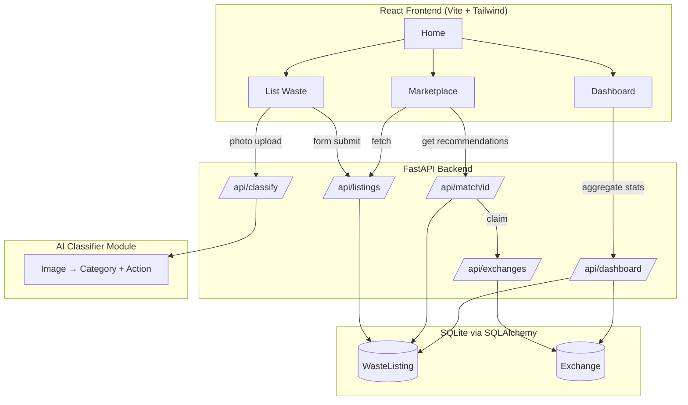

# 🌱 Revora — Circular Waste Exchange Platform

**"Turning waste into resources, not landfill."**

| | |
|---|---|
| **Team** | _[AI IGNITE]_ |
| **Members** | _[KAAVIYA — FRONTEND], [SUBHA — DATABASE], [SREE — BACKEND],[PASUMPON — UI/DESIGN],[NARESH — BACKEND],[NITHINRAJ — Docs & integration]_|
| **Track** | Sustainability / CleanTech / MedTech-adjacent (SIH-style) |
| **Repo** | _[https://github.com/nithin-raj-07/AI-IGNITE]_ |

---

## 1. Problem Statement

Industries, businesses, farms, and households generate large volumes of waste that
could be reused by someone else, but:

- There's no simple platform connecting waste **generators** with **recyclers/buyers**.
- Reusable materials routinely end up in landfills instead of back in circulation.
- This drives up pollution and disposal costs, and wastes recoverable material value.

## 2. Solution

Revora is a circular-economy marketplace where:

- **Waste generators** list reusable waste (photo, type, quantity, location, pickup window).
- An **AI classifier** identifies the waste category from the photo and recommends an action
  (recycle / reuse / compost / donate).
- **Smart matching** recommends nearby recyclers, NGOs, or businesses interested in that
  material.
- **Recyclers & NGOs** search and claim listings.
- **Municipal authorities** get a live dashboard of waste flow, CO₂ avoided, and landfill diversion.
- **Eco Points** gamify participation with a redeemable-certificate prototype.

## 3. Features

| Feature | Status |
|---|---|
| 🗑️ Waste listing (photo, type, qty, location, pickup) | ✅ Built |
| 🤖 AI waste classifier (6 categories + suggested action) | ✅ Built (prototype heuristic, see §9) |
| 🔍 Smart matching to nearby recyclers | ✅ Built (directory-based prototype) |
| 📊 Impact dashboard (waste recycled, CO₂ avoided, exchanges, landfill diverted) | ✅ Built |
| 🗺️ Map view of listings & collection points | 🔜 Planned (see Future Scope) |
| ⭐ Eco Points gamification | 🔜 Prototype-only stub in Exchange model |

## 4. Tech Stack

**Frontend:** React 18 + Vite, Tailwind CSS, Framer Motion, Recharts, React Router, Axios, lucide-react
**Backend:** Python, FastAPI, Uvicorn
**Database:** SQLite via SQLAlchemy (swappable for Postgres/Firebase in production)
**AI:** Pillow-based image heuristic classifier (prototype) — architected to be swapped for a
fine-tuned MobileNetV2/EfficientNet CNN
**Data processing:** Pandas (dashboard aggregation)
**Maps (planned):** OpenStreetMap / Leaflet

## 5. System Architecture



## 6. Detailed Workflow

1. **Generator uploads a photo** on the "List Waste" page.
2. Frontend sends the image to `POST /api/classify`; the AI module returns a waste
   type (plastic / metal / paper / glass / e-waste / organic) and a suggested action
   (recycle / reuse / compost / donate) with a confidence score.
3. Generator fills in quantity, location, and contact, then submits — creating a
   `WasteListing` row and an estimated CO₂-avoided figure.
4. **Recyclers/NGOs** browse `Marketplace`, optionally filtered by type, calling
   `GET /api/listings`.
5. `GET /api/match/{id}` recommends recyclers for a given listing based on waste type.
6. When a recycler claims a listing, `POST /api/exchanges` marks it `collected`,
   logs an `Exchange` record, and awards Eco Points (prototype).
7. `GET /api/dashboard` aggregates all listings/exchanges with Pandas into totals shown
   on the **Dashboard**: total waste listed, CO₂ avoided, successful exchanges, and
   landfill diverted.

## 7. Folder Structure

```
revora/
├── backend/
│   ├── main.py          # FastAPI app & all API routes
│   ├── models.py         # SQLAlchemy models (WasteListing, Exchange)
│   ├── classifier.py      # AI waste classifier + CO2 estimator
│   └── requirements.txt
├── frontend/
│   ├── index.html
│   ├── package.json
│   ├── vite.config.js
│   ├── tailwind.config.js
│   ├── postcss.config.js
│   └── src/
│       ├── main.jsx
│       ├── App.jsx
│       ├── api.js
│       ├── index.css
│       ├── components/
│       │   ├── Navbar.jsx
│       │   ├── StatCard.jsx
│       │   └── WasteCard.jsx
│       └── pages/
│           ├── Home.jsx
│           ├── ListWaste.jsx
│           ├── Marketplace.jsx
│           └── Dashboard.jsx
├── docs/                  # screenshots, diagrams (add your own)
├── .gitignore
└── README.md
```

## 8. Installation & Usage

### Backend
```bash
cd backend
python -m venv venv && source venv/bin/activate   # Windows: venv\Scripts\activate
pip install -r requirements.txt
uvicorn main:app --reload --port 8000
```
API docs available at `http://localhost:8000/docs` (FastAPI auto-generated Swagger UI).

### Frontend
```bash
cd frontend
npm install
npm run dev
```
App runs at `http://localhost:5173`. Set `VITE_API_URL` in a `.env` file if the backend
isn't on `localhost:8000`.

## 9. API Documentation

| Method | Endpoint | Description |
|---|---|---|
| `POST` | `/api/classify` | Upload image, returns `{waste_type, suggested_action, confidence}` |
| `POST` | `/api/listings` | Create a waste listing (form data) |
| `GET` | `/api/listings` | List all listings, optional `waste_type`/`status` filters |
| `GET` | `/api/listings/{id}` | Get one listing |
| `GET` | `/api/match/{id}` | Recommended recyclers for a listing |
| `POST` | `/api/exchanges` | Complete an exchange, awards Eco Points |
| `GET` | `/api/dashboard` | Aggregate impact stats |

### Database schema
- **WasteListing**: `id, title, waste_type, suggested_action, quantity_kg, location, latitude, longitude, pickup_available, posted_by, status, co2_saved_kg, created_at`
- **Exchange**: `id, listing_id, recycler_name, eco_points_awarded, completed_at`

## 10. AI/ML Workflow

The hackathon prototype (`backend/classifier.py`) uses a **Pillow-based color heuristic**
plus filename-keyword override, so the demo works instantly without a model download or
GPU. It returns the same response shape a real model would.

**Production swap-in plan:**
1. Collect/label a dataset across the 6 categories (TrashNet, TACO, or a custom-labeled set of Indian waste photos work well).
2. Fine-tune a lightweight pretrained CNN (MobileNetV2 or EfficientNet-B0) via transfer learning.
3. Export to ONNX/TFLite for fast inference; swap `classify_image()`'s body for a model call — the API contract (`waste_type`, `suggested_action`, `confidence`) doesn't need to change, so the frontend is unaffected.
4. Track real-world confidence and misclassifications to retrain periodically.

## 11. Security Measures

- Environment-based config (DB URL, API URL) — no secrets committed.
- CORS explicitly configured (tighten `allow_origins` before production deploy).
- Input validation via Pydantic/FastAPI form typing on every endpoint.
- Planned for production: JWT-based auth for posting listings, rate limiting on `/api/classify`, and image size/type validation before upload.

## 12. Testing & Performance

- Manual endpoint testing via FastAPI's Swagger UI (`/docs`).
- Suggested next step: `pytest` + `httpx.AsyncClient` test suite for each route (create/list/match/exchange), and React Testing Library for component tests.
- SQLite is fine for demo scale; recommend Postgres + indexing on `waste_type`/`status` before real traffic.

## 13. Challenges Faced

- Balancing a fast, dependency-light AI demo against wanting a "real" model — solved by
  architecting the classifier behind a stable interface so it's a drop-in swap later.
- Designing smart matching without a live recycler database — used a seeded directory as
  a placeholder, structured so it maps cleanly onto a real `Recycler` table.

## 14. Future Scope

- Real trained CNN classifier + confidence-based human review queue.
- Live map view (Leaflet/OpenStreetMap) of listings and collection points.
- Recycler/NGO onboarding flow with verified profiles.
- Real Eco Points redemption (certificates, discounts with partner recyclers).
- SMS/WhatsApp listing flow for low-connectivity users (India-specific reach).

## 15. Demo Screenshots / Video

_[Add screenshots of Home, List Waste, Marketplace, Dashboard here — drag images into `docs/` and reference them, e.g.]_
```

```
_[Add demo video link here]_

## 16. References

- TrashNet dataset — https://github.com/garythung/trashnet
- TACO (Trash Annotations in Context) — http://tacodataset.org/
- FastAPI docs — https://fastapi.tiangolo.com/
- React docs — https://react.dev/
